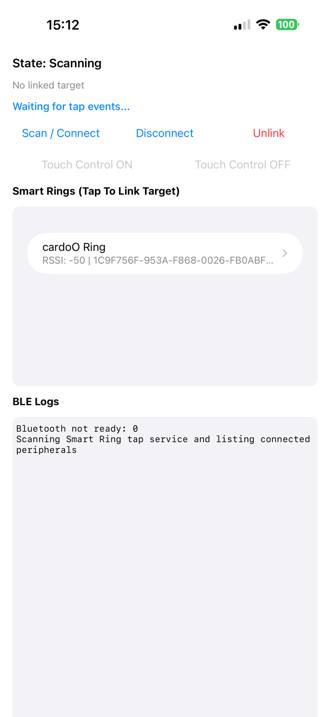
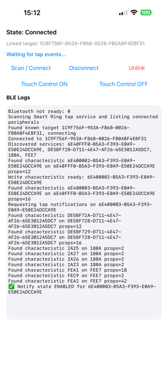
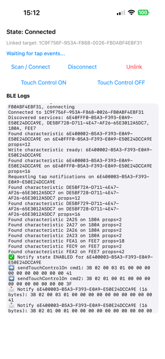
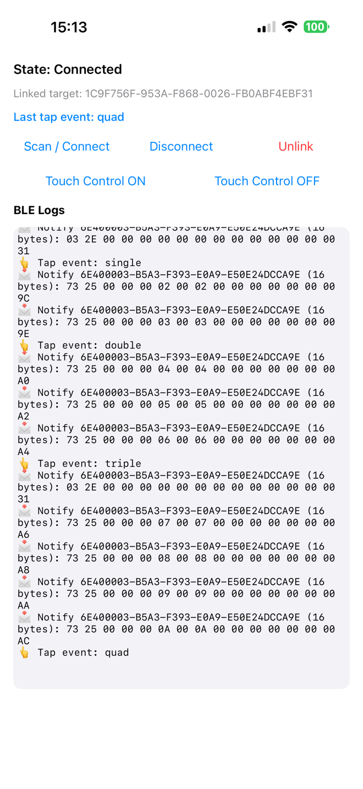

# R08 iOS Sample (Smart Ring)

A UIKit iPhone sample app that follows the same MVVM + ViewController pattern used in your Halliday sample, adapted for Smart Ring BLE.

## Screenshots

### 1) Scan and Link Target



### 2) Connected and Notify Enabled



### 3) Touch Control Command Logs



### 4) Tap Events (Quad Example)



## What This Project Includes

- iOS app target: `R08IPhoneSample`
- Local SPM package: `Core`
- Local SPM package: `SmartRingCommunicationModule`

## Current BLE Scope

This sample intentionally includes only:

- Device discovery and connection for Smart Ring service
- Tap event notifications parsing
- Touch control send commands:
  - `sendTouchControlOn()`
  - `sendTouchControlOff()`

It intentionally excludes all other ring data fetching (battery, HR, temperature, SpO2, etc.).

## UX Behavior

- If no target UUID is stored, app scans and lists available devices.
- When user selects a device, its UUID is saved in `UserDefaults`.
- On next app launch, if UUID exists, app tries reconnecting directly.
- `Unlink` button clears stored UUID and returns to scan flow.
- BLE logs are shown live in hex format with auto-scroll.

## Architecture

### App Layer (`App/Sources/App`)

- `HomeViewController`: UIKit screen, table/list, logs, and action buttons
- `HomeViewModel`: input/output binding using Combine, state mapping, persistence logic

### `Core` Package

Contains BLE-agnostic contracts and models:

- `SmartRingBLEManaging`
- `SmartRingConnectionState`
- `SmartRingDiscoveredDevice`
- `SmartRingTarget`
- `SmartRingTapEvent`
- `SmartRingUUIDs`

### `SmartRingCommunicationModule` Package

Contains BLE implementation and coordinator:

- `BLEManager` (CoreBluetooth implementation)
- `SmartRingController` (app-facing API)
- `SmartRingCommunicationModuleOrganizer` (shared access point)

## Requirements

- Xcode 26+
- Swift 5.9+
- [XcodeGen](https://github.com/yonaskolb/XcodeGen)
- iOS 16.0+

## Generate and Open

```bash
cd /Users/filippospirpilidis/Projects/halliday-sample/r08-ios-sample
xcodegen generate
open R08IPhoneSample.xcodeproj
```

## Build (Optional CLI Check)

```bash
cd /Users/filippospirpilidis/Projects/halliday-sample/r08-ios-sample/Packages/Core
swift build

cd /Users/filippospirpilidis/Projects/halliday-sample/r08-ios-sample/Packages/SmartRingCommunicationModule
swift build
```

## Notes

- Bluetooth usage strings are already configured in `Info.plist`.
- The app is configured for iPhone (`TARGETED_DEVICE_FAMILY = 1`).
